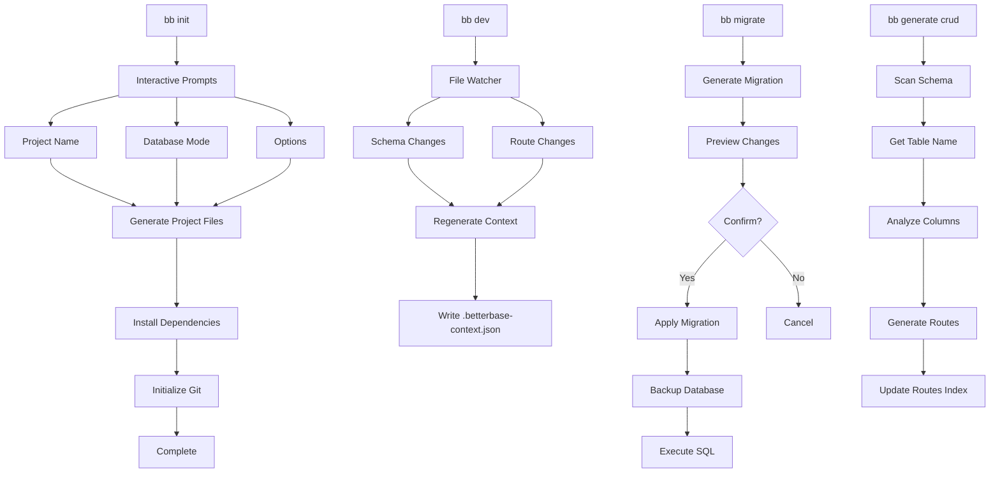
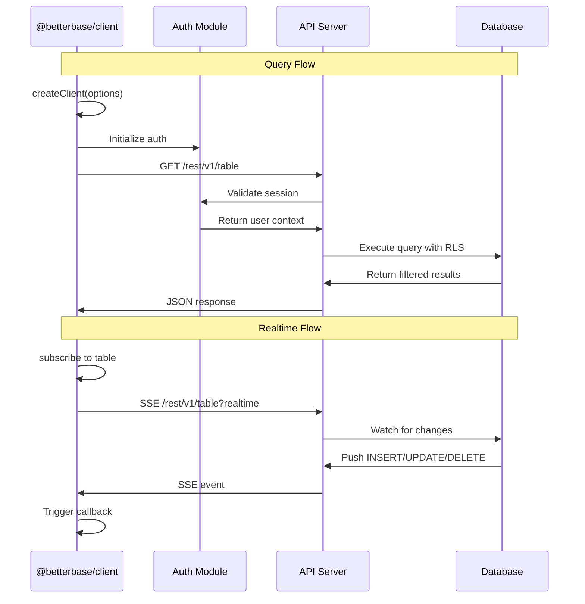
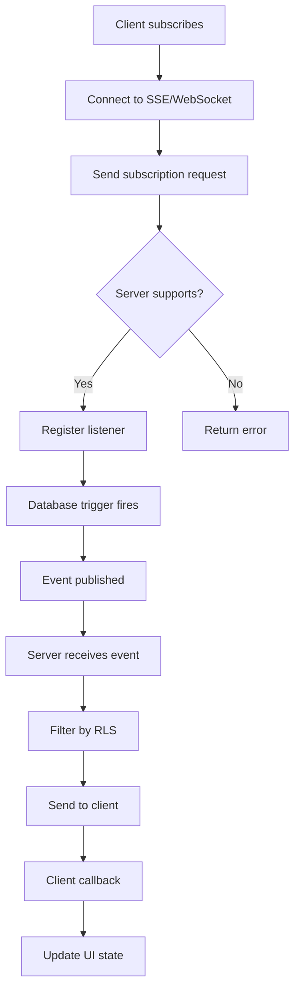
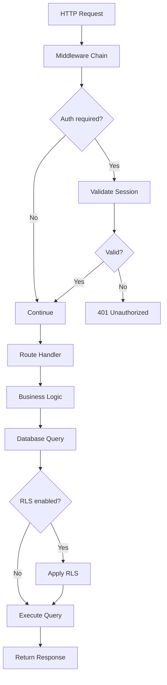

# BetterBase — Complete Codebase Map

> Auto-generated. Regenerate with: [paste this prompt into Cursor]
> Last updated: 2026-03-01

## Project Identity

**BetterBase** is an AI-native Backend-as-a-Service (BaaS) platform inspired by Supabase. It provides a TypeScript-first developer experience with a focus on AI context generation, Docker-less local development, and zero lock-in. The stack is built on **Bun** (runtime), **Turborepo** (monorepo), **Hono** (API framework), **Drizzle ORM** (database), and **BetterAuth** (authentication: AI-first context). The philosophy emphasizes generation via `.betterbase-context.json`, sub-100ms startup with `bun:sqlite`, user-owned schemas, and strict TypeScript with Zod validation everywhere.

---

## Monorepo Structure Overview

```mermaid
graph TB
    subgraph Root
        Root[pkgjson<br/>turbojson<br/>tsconfigbasjson]
    end
    
    subgraph packages
        CLI[packages/cli<br/>11 commands<br/>6 utils]
        Client[packages/client<br/>8 modules]
        Core[packages/core<br/>9 modules]
        Shared[packages/shared<br/>5 utilities]
    end
    
    subgraph templates
        Base[templates/base]
        Auth[templates/auth]
    end
    
    Root --> CLI
    Root --> Client
    Root --> Core
    Root --> Shared
    Root --> Base
    Root --> Auth
```

```
betterbase/
├── package.json                    # Root workspace config
├── turbo.json                      # Turborepo task configuration
├── tsconfig.base.json             # Shared TypeScript config
├── bun.lock                        # Bun lockfile
├── CODEBASE_MAP.md                 # This file
├── README.md                       # Project documentation
├── .gitignore                      # Git ignore patterns
├── .npmignore                      # npm ignore patterns
├── betterbase_auth_refactor.md     # Auth refactoring notes
├── betterbase_backend_rebuild.md   # Backend rebuild notes
├── betterbase_blueprint_v3.md      # Blueprint v3
│
├── packages/
│   ├── cli/                        # @betterbase/cli - CLI tool (bb command)
│   │   ├── package.json
│   │   ├── tsconfig.json
│   │   ├── src/
│   │   │   ├── index.ts            # Main CLI entry point
│   │   │   ├── build.ts           # Build script
│   │   │   ├── constants.ts       # Shared constants
│   │   │   ├── commands/          # CLI commands (11 files)
│   │   │   └── utils/             # CLI utilities (7 files)
│   │   └── test/                  # CLI tests (4 files)
│   │
│   ├── client/                     # @betterbase/client - Client SDK
│   │   ├── package.json
│   │   ├── tsconfig.json
│   │   ├── tsconfig.test.json
│   │   ├── src/                    # Client SDK (9 files)
│   │   └── test/                   # Client tests (1 file)
│   │
│   ├── core/                       # @betterbase/core - Core backend engine
│   │   ├── package.json
│   │   ├── tsconfig.json
│   │   └── src/
│   │       ├── index.ts            # Core exports
│   │       ├── config/            # Configuration modules
│   │       ├── functions/         # Serverless functions
│   │       ├── graphql/           # GraphQL server
│   │       ├── middleware/        # Middleware (RLS session)
│   │       ├── migration/         # Database migrations
│   │       ├── providers/         # Database providers
│   │       ├── rls/               # Row Level Security
│   │       ├── storage/           # Storage adapter
│   │       └── webhooks/          # Webhook handling
│   │
│   └── shared/                     # @betterbase/shared - Shared utilities
│       ├── package.json
│       ├── tsconfig.json
│       └── src/
│           ├── index.ts
│           ├── constants.ts
│           ├── errors.ts
│           ├── types.ts
│           └── utils.ts
│
└── templates/
    ├── base/                       # Bun + Hono + Drizzle starter
    │   ├── package.json
    │   ├── betterbase.config.ts
    │   ├── drizzle.config.ts
    │   ├── tsconfig.json
    │   ├── README.md
    │   └── src/
    │       ├── index.ts
    │       ├── auth/              # Auth module
    │       ├── db/                # Database schema & migrate
    │       ├── functions/        # Serverless functions
    │       ├── lib/               # Utilities (env, realtime)
    │       ├── middleware/        # Route middleware
    │       └── routes/            # API routes
    │
    └── auth/                       # Auth template with BetterAuth
        ├── README.md
        └── src/
            ├── auth/              # Auth setup
            ├── db/               # Auth schema
            ├── middleware/        # Auth middleware
            └── routes/           # Auth routes
```

---

## Root-Level Files

### [`package.json`](package.json)
**Purpose:** Root workspace configuration for Turborepo monorepo.
- **Key Fields:** `name: "betterbase"`, workspaces: `["packages/*", "templates/*"]`
- **Scripts:** Build, test, and dev scripts using turbo
- **Dependencies:** `turbo@^2.3.0`

### [`turbo.json`](turbo.json)
**Purpose:** Turborepo task configuration defining build pipelines.
- **Tasks:** `build`, `test`, `lint` with cache settings
- **Dependencies:** Build depends on ^build, test depends on ^test

### [`tsconfig.base.json`](tsconfig.base.json)
**Purpose:** Shared TypeScript configuration for all packages.
- **Target:** ES2022
- **Module:** NodeNext
- **Strict:** Enabled
- **Module Resolution:** NodeNext

---

## packages/cli

Canonical `@betterbase/cli` implementation - the `bb` command-line tool.

### CLI Commands

#### [`commands/init.ts`](packages/cli/src/commands/init.ts)
**Purpose:** `bb init` command - scaffolds new BetterBase projects.
- **Exports:** `runInitCommand(options)` - main command function, `InitCommandOptions` - type
- **Key Functions:** `installDependencies()`, `initializeGitRepository()`, `buildPackageJson()`, `buildDrizzleConfig()`, `buildSchema()`, `buildMigrateScript()`, `buildDbIndex()`, `buildAuthMiddleware()`, `buildReadme()`, `buildRoutesIndex()`, `writeProjectFiles()`
- **Internal Deps:** `../utils/logger`, `../utils/prompts`
- **Usage Patterns:** Typically called by developers starting a new project. Uses interactive prompts to gather project name, database mode, and options. Creates a complete project structure with sensible defaults.
- **Implementation Details:** Uses Inquirer for interactive prompts, writes files synchronously using fs module. Supports three database modes: local (SQLite), neon (PostgreSQL), turso (LibSQL). Generates Zod-validated config. Implements file templating with template literals for code generation.
- **External Deps:** `inquirer`, `zod`, `chalk`
- **Cross-Ref:** [`packages/cli/src/utils/prompts.ts`](packages/cli/src/utils/prompts.ts), [`templates/base/`](templates/base/)

#### [`commands/dev.ts`](packages/cli/src/commands/dev.ts)
**Purpose:** `bb dev` command - watches schema/routes and regenerates context.
- **Exports:** `runDevCommand(projectRoot)` - returns cleanup function
- **Internal Deps:** `../utils/context-generator`, `../utils/logger`
- **Usage Patterns:** Runs during development to continuously regenerate `.betterbase-context.json` as files change.
- **Implementation Details:** Sets up file watchers on schema and routes directories, triggers context regeneration on changes. Returns cleanup function to stop watchers.
- **External Deps:** `bun`, `chalk`
- **Cross-Ref:** [`packages/cli/src/utils/context-generator.ts`](packages/cli/src/utils/context-generator.ts)

#### [`commands/migrate.ts`](packages/cli/src/commands/migrate.ts)
**Purpose:** `bb migrate` commands - generates and applies migrations with safety checks.
- **Exports:** `runMigrateCommand(options)` - main function, `MigrateCommandOptions` - type, `MigrationChange` - interface, `MigrationChangeType` - type
- **Key Functions:** `runDrizzleKit()`, `listSqlFiles()`, `analyzeMigration()`, `displayDiff()`, `confirmDestructive()`, `backupDatabase()`, `restoreBackup()`, `splitStatements()`, `collectChangesFromGenerate()`
- **Internal Deps:** `../constants`, `../utils/logger`, `../utils/prompts`
- **Usage Patterns:** Called during database schema changes. Generates migration files, optionally previews changes, applies with safety checks.
- **Implementation Details:** Wraps DrizzleKit for migration generation. Implements visual diff display with color-coded changes. Prompts for confirmation on destructive operations. Creates automatic backups before dangerous migrations. Parses SQL files to extract migration metadata.
- **External Deps:** `drizzle-orm`, `drizzle-kit`, `inquirer`, `chalk`, `zod`

#### [`commands/auth.ts`](packages/cli/src/commands/auth.ts)
**Purpose:** `bb auth setup` command - scaffolds BetterAuth integration.
- **Exports:** `runAuthSetupCommand(projectRoot)` - main function
- **Key Constants:** `AUTH_SCHEMA_BLOCK` - sessions/accounts tables SQL, `AUTH_ROUTE_FILE` - auth routes template, `AUTH_MIDDLEWARE_FILE` - requireAuth/optionalAuth middleware
- **Key Functions:** `appendIfMissing()`, `ensurePasswordHashColumn()`, `ensureAuthInConfig()`, `ensureEnvVar()`, `ensureRoutesIndexHook()`
- **Internal Deps:** `../utils/logger`
- **Usage Patterns:** Run after project initialization to add authentication. Modifies existing files to integrate BetterAuth.
- **Implementation Details:** Injects SQL schema blocks into existing schema file, adds auth routes to routes index, creates auth middleware. Uses file patching rather than full file generation for integration.
- **External Deps:** `better-auth`, `chalk`
- **Cross-Ref:** [`templates/auth/`](templates/auth/)

#### [`commands/generate.ts`](packages/cli/src/commands/generate.ts)
**Purpose:** `bb generate crud` command - generates CRUD routes for a table.
- **Exports:** `runGenerateCrudCommand(projectRoot, tableName)` - main function
- **Key Functions:** `toSingular()`, `schemaTypeToZod()`, `buildSchemaShape()`, `buildFilterableColumns()`, `buildFilterCoercers()`, `generateRouteFile()`, `updateMainRouter()`, `ensureRealtimeUtility()`, `ensureZodValidatorInstalled()`
- **Internal Deps:** `../utils/schema-scanner`, `../utils/logger`
- **Usage Patterns:** Called after creating a database table to auto-generate REST API routes. Saves developers from writing boilerplate CRUD code.
- **Implementation Details:** Scans Drizzle schema to understand table structure. Maps Drizzle column types to Zod schemas. Generates Hono routes with type-safe handlers. Updates route index to register new endpoints.
- **External Deps:** `zod`, `hono`, `drizzle-orm`, `chalk`
- **Cross-Ref:** [`packages/cli/src/utils/scanner.ts`](packages/cli/src/utils/scanner.ts)

#### [`commands/function.ts`](packages/cli/src/commands/function.ts)
**Purpose:** `bb function` command - manages serverless functions.
- **Exports:** Function management commands (create, deploy, list, invoke)
- **Key Functions:** Function deployment and bundling
- **Internal Deps:** `../utils/logger`, `../utils/prompts`
- **Usage Patterns:** Deploy and manage serverless functions.
- **Implementation Details:** Handles function bundling, deployment to edge, and invocation.
- **External Deps:** `chalk`, `inquirer`

#### [`commands/graphql.ts`](packages/cli/src/commands/graphql.ts)
**Purpose:** `bb graphql` command - GraphQL schema management.
- **Exports:** GraphQL schema generation and introspection commands
- **Key Functions:** Schema generation, SDL export
- **Internal Deps:** `../utils/logger`, `../utils/prompts`
- **Usage Patterns:** Generate GraphQL schema from database, export SDL.
- **Implementation Details:** Uses Drizzle introspection to generate GraphQL types.
- **External Deps:** `chalk`, `inquirer`

#### [`commands/login.ts`](packages/cli/src/commands/login.ts)
**Purpose:** `bb login` command - authenticate with BetterBase cloud.
- **Exports:** `runLoginCommand(options)` - main function
- **Internal Deps:** `../utils/logger`
- **Usage Patterns:** Authenticate to BetterBase to access cloud features.
- **Implementation Details:** Handles OAuth flow or API key authentication.
- **External Deps:** `chalk`

#### [`commands/rls.ts`](packages/cli/src/commands/rls.ts)
**Purpose:** `bb rls` command - Row Level Security management.
- **Exports:** RLS policy management commands
- **Key Functions:** Policy creation, enable/disable RLS
- **Internal Deps:** `../utils/logger`
- **Usage Patterns:** Manage RLS policies for tables.
- **Implementation Details:** Generates RLS policies based on table structure.
- **External Deps:** `chalk`, `drizzle-orm`

#### [`commands/storage.ts`](packages/cli/src/commands/storage.ts)
**Purpose:** `bb storage` command - storage bucket management.
- **Exports:** Storage bucket management commands
- **Key Functions:** Bucket CRUD operations, policy management
- **Internal Deps:** `../utils/logger`, `../utils/prompts`
- **Usage Patterns:** Manage storage buckets and files.
- **Implementation Details:** Integrates with S3-compatible storage.
- **External Deps:** `chalk`, `inquirer`

#### [`commands/webhook.ts`](packages/cli/src/commands/webhook.ts)
**Purpose:** `bb webhook` command - webhook management.
- **Exports:** Webhook lifecycle management commands
- **Key Functions:** Webhook creation, testing, logging
- **Internal Deps:** `../utils/logger`
- **Usage Patterns:** Register and manage webhooks for database events.
- **Implementation Details:** Handles webhook registration and event dispatch.
- **External Deps:** `chalk`

### CLI Utilities

#### [`utils/logger.ts`](packages/cli/src/utils/logger.ts)
**Purpose:** Colored console logging utilities.
- **Exports:** `info(message)`, `warn(message)`, `error(message)`, `success(message)`
- **Internal Deps:** `chalk`
- **Usage Patterns:** Used throughout CLI commands for consistent, colored output.
- **Implementation Details:** Thin wrapper around Chalk with pre-configured color schemes. Info = cyan, Warn = yellow, Error = red, Success = green.
- **External Deps:** `chalk`

#### [`utils/prompts.ts`](packages/cli/src/utils/prompts.ts)
**Purpose:** Interactive prompt utilities wrapping Inquirer.
- **Exports:** `text(options)`, `confirm(options)`, `select(options)`
- **Internal Deps:** `inquirer`, `zod`
- **Usage Patterns:** Used by CLI commands that need user input during execution.
- **Implementation Details:** Wraps Inquirer with Zod validation on input. Provides typed promise-based API.
- **External Deps:** `inquirer`, `zod`

#### [`utils/context-generator.ts`](packages/cli/src/utils/context-generator.ts)
**Purpose:** Generates `.betterbase-context.json` for AI agents.
- **Exports:** `ContextGenerator` - class, `BetterBaseContext` - interface
- **Class Methods:** `generate(projectRoot)` - main method, `generateAIPrompt()` - creates AI-readable prompt
- **Internal Deps:** `./route-scanner`, `./schema-scanner`, `./logger`
- **Usage Patterns:** Called during `bb dev` or `bb generate` to create context file. Used by AI assistants to understand the project structure.
- **Implementation Details:** Scans schema and routes, aggregates metadata, outputs JSON file with tables, routes, and AI-readable prompt. The AI prompt helps contextualize the project for LLM-based development assistance.
- **External Deps:** `typescript`, `zod`, `chalk`
- **Cross-Ref:** [`packages/cli/src/utils/route-scanner.ts`](packages/cli/src/utils/route-scanner.ts), [`packages/cli/src/utils/scanner.ts`](packages/cli/src/utils/scanner.ts)

#### [`utils/route-scanner.ts`](packages/cli/src/utils/route-scanner.ts)
**Purpose:** Scans Hono routes directory and extracts endpoint metadata.
- **Exports:** `RouteScanner` - class, `RouteInfo` - interface
- **Class Methods:** `scan(routesDir)` - main method, `scanFile()` - parses single file, `findSchemaUsage()` - detects Zod schemas
- **Internal Deps:** `typescript` (TS AST parser)
- **Usage Patterns:** Used by context generator to discover all API endpoints in the project.
- **Implementation Details:** Uses TypeScript compiler API to parse route files. Extracts HTTP method, path, auth requirements, and Zod schemas. Handles Hono's chainable API pattern detection.
- **External Deps:** `typescript`

#### [`utils/scanner.ts`](packages/cli/src/utils/scanner.ts)
**Purpose:** Scans Drizzle schema files and extracts table metadata.
- **Exports:** `SchemaScanner` - class, `ColumnInfo` - type, `TableInfo` - type, `ColumnInfoSchema`, `TableInfoSchema`, `TablesRecordSchema` - Zod schemas
- **Class Methods:** `scan()` - main method, `parseTable()`, `parseColumn()`, `parseIndexes()`
- **Internal Deps:** `typescript`, `zod`, `./logger`
- **Usage Patterns:** Used by generate command and context generator to understand database schema.
- **Implementation Details:** Parses TypeScript schema files using TypeScript compiler API. Extracts table names, column definitions, relations, indexes. Returns typed metadata for code generation.
- **External Deps:** `typescript`, `zod`

#### [`utils/schema-scanner.ts`](packages/cli/src/utils/schema-scanner.ts)
**Purpose:** Re-exports from scanner.ts for cleaner imports.
- **Exports:** `SchemaScanner` - class (re-export), `ColumnInfo` - type (re-export), `TableInfo` - type (re-export)
- **Usage Patterns:** Import point for schema scanning functionality.
- **External Deps:** None (re-exports)

#### [`utils/provider-prompts.ts`](packages/cli/src/utils/provider-prompts.ts)
**Purpose:** Database provider selection prompts.
- **Exports:** Provider selection utilities
- **Usage Patterns:** Used by init command to select database provider.
- **Implementation Details:** Provides interactive selection for database providers (PostgreSQL, MySQL, SQLite).
- **External Deps:** `inquirer`

### CLI Tests

#### [`test/smoke.test.ts`](packages/cli/test/smoke.test.ts)
**Purpose:** Basic CLI tests verifying command registration.
- **Tests:** Program name, init argument, generate crud, auth setup, dev, migrate commands
- **Usage Patterns:** Smoke tests run in CI to verify CLI is functional after changes.

#### [`test/scanner.test.ts`](packages/cli/test/scanner.test.ts)
**Purpose:** Tests for SchemaScanner.
- **Tests:** Extracts tables, columns, relations, indexes from Drizzle schema
- **Usage Patterns:** Unit tests for scanner module.

#### [`test/context-generator.test.ts`](packages/cli/test/context-generator.test.ts)
**Purpose:** Tests for ContextGenerator.
- **Tests:** Creates context from schema/routes, handles missing routes, empty schema, missing schema
- **Usage Patterns:** Unit tests for context generation.

#### [`test/route-scanner.test.ts`](packages/cli/test/route-scanner.test.ts)
**Purpose:** Tests for RouteScanner.
- **Tests:** Extracts Hono routes with auth detection and schema usage
- **Usage Patterns:** Unit tests for route scanning.

---

## packages/client

`@betterbase/client` - TypeScript SDK for BetterBase backends (like `@supabase/supabase-js`).

### Client Modules

#### [`src/auth.ts`](packages/client/src/auth.ts)
**Purpose:** Authentication client for BetterAuth integration.
- **Exports:** Auth client methods (signIn, signOut, getUser, etc.)
- **Key Functions:** User authentication, session management, provider OAuth
- **Usage Patterns:** Used by frontend applications to authenticate users.
- **Implementation Details:** Wraps BetterAuth client for use in browser/Node.js environments.
- **External Deps:** `better-auth`

#### [`src/client.ts`](packages/client/src/client.ts)
**Purpose:** Main BetterBase client constructor.
- **Exports:** `createClient(options)` - client factory function
- **Key Types:** `BetterBaseClientOptions`, `BetterBaseClient`
- **Usage Patterns:** Primary entry point for creating a BetterBase client instance.
- **Implementation Details:** Configures auth, storage, realtime, and database connections.

#### [`src/query-builder.ts`](packages/client/src/query-builder.ts)
**Purpose:** Chainable query builder for database operations.
- **Exports:** Query builder class with chainable methods
- **Key Methods:** `.select()`, `.insert()`, `.update()`, `.delete()`, `.from()`, `.where()`
- **Usage Patterns:** Build type-safe database queries.
- **Implementation Details:** Fluent API for constructing queries, returns typed results.
- **External Deps:** `drizzle-orm`

#### [`src/realtime.ts`](packages/client/src/realtime.ts)
**Purpose:** Real-time subscription client for database changes.
- **Exports:** Realtime client with subscription methods
- **Key Methods:** `.subscribe()`, `.unsubscribe()`, `.on()`
- **Usage Patterns:** Subscribe to database INSERT/UPDATE/DELETE events.
- **Implementation Details:** Uses Server-Sent Events (SSE) or WebSocket for real-time updates.

#### [`src/storage.ts`](packages/client/src/storage.ts)
**Purpose:** Storage client for file operations.
- **Exports:** Storage client with file upload/download methods
- **Key Methods:** `.upload()`, `.download()`, `.delete()`, `.getPublicUrl()`
- **Usage Patterns:** Manage files in storage buckets.
- **Implementation Details:** Integrates with S3-compatible storage.

#### [`src/types.ts`](packages/client/src/types.ts)
**Purpose:** TypeScript type definitions for client.
- **Exports:** All client types and interfaces
- **Key Types:** `User`, `Session`, `StorageFile`, `RealtimeEvent`

#### [`src/errors.ts`](packages/client/src/errors.ts)
**Purpose:** Client-side error classes.
- **Exports:** Custom error classes (AuthError, StorageError, etc.)

#### [`src/index.ts`](packages/client/src/index.ts)
**Purpose:** Client package entry point.
- **Exports:** All public APIs from the client package

#### [`src/build.ts`](packages/client/src/build.ts)
**Purpose:** Build configuration for client package.

---

## packages/core

`@betterbase/core` - Core backend engine with all server-side functionality.

### Core Modules

#### [`src/index.ts`](packages/core/src/index.ts)
**Purpose:** Core package entry point exporting all modules.

### config/

#### [`config/index.ts`](packages/core/src/config/index.ts)
**Purpose:** Configuration module exports.

#### [`config/schema.ts`](packages/core/src/config/schema.ts)
**Purpose:** Project configuration schema validation.
- **Key Types:** `BetterBaseConfig`, `DatabaseConfig`, `AuthConfig`
- **Usage Patterns:** Validate project configuration files.

#### [`config/drizzle-generator.ts`](packages/core/src/config/drizzle-generator.ts)
**Purpose:** Drizzle configuration generator.
- **Key Functions:** Generate drizzle.config.ts from project config.
- **Usage Patterns:** Used during project initialization.

### functions/

#### [`functions/index.ts`](packages/core/src/functions/index.ts)
**Purpose:** Serverless functions module exports.

#### [`functions/bundler.ts`](packages/core/src/functions/bundler.ts)
**Purpose:** Bundles serverless functions for deployment.
- **Key Functions:** `bundleFunction()`, `bundleAll()`
- **Usage Patterns:** Bundle functions for edge deployment.
- **Implementation Details:** Uses esbuild for fast bundling.

#### [`functions/deployer.ts`](packages/core/src/functions/deployer.ts)
**Purpose:** Deploys serverless functions to edge.
- **Key Functions:** `deployFunction()`, `deployAll()`
- **Usage Patterns:** Deploy functions to cloud edge.

### graphql/

#### [`graphql/index.ts`](packages/core/src/graphql/index.ts)
**Purpose:** GraphQL module exports.

#### [`graphql/resolvers.ts`](packages/core/src/graphql/resolvers.ts)
**Purpose:** GraphQL resolver implementations.
- **Key Types:** Query resolvers, Mutation resolvers
- **Usage Patterns:** Handle GraphQL operations against database.

#### [`graphql/schema-generator.ts`](packages/core/src/graphql/schema-generator.ts)
**Purpose:** Generates GraphQL schema from database.
- **Key Functions:** `generateSchema()`, `introspectDatabase()`
- **Usage Patterns:** Auto-generate GraphQL API from Drizzle schema.

#### [`graphql/sdl-exporter.ts`](packages/core/src/graphql/sdl-exporter.ts)
**Purpose:** Exports GraphQL schema as SDL.
- **Key Functions:** `exportSDL()`, `writeSDL()`
- **Usage Patterns:** Export GraphQL schema for external tools.

#### [`graphql/server.ts`](packages/core/src/graphql/server.ts)
**Purpose:** GraphQL HTTP server setup.
- **Key Functions:** `createGraphQLServer()`, `createHandler()`
- **Usage Patterns:** Run GraphQL server with Hono.

### middleware/

#### [`middleware/index.ts`](packages/core/src/middleware/index.ts)
**Purpose:** Middleware module exports.

#### [`middleware/rls-session.ts`](packages/core/src/middleware/rls-session.ts)
**Purpose:** RLS session middleware for Hono.
- **Key Functions:** `createRLSMiddleware()`, `attachSession()`
- **Usage Patterns:** Attach user session to request context for RLS.
- **Implementation Details:** Extracts session from auth, makes available for RLS checks.

### migration/

#### [`migration/index.ts`](packages/core/src/migration/index.ts)
**Purpose:** Migration module exports.

#### [`migration/rls-migrator.ts`](packages/core/src/migration/rls-migrator.ts)
**Purpose:** Migrates RLS policies between versions.
- **Key Functions:** `migrateRLS()`, `backupPolicies()`, `restorePolicies()`
- **Usage Patterns:** Safely migrate RLS policies during schema changes.

### providers/

#### [`providers/index.ts`](packages/core/src/providers/index.ts)
**Purpose:** Database providers module exports.

#### [`providers/types.ts`](packages/core/src/providers/types.ts)
**Purpose:** Provider interface definitions.
- **Key Types:** `DatabaseProvider`, `ProviderConfig`
- **Usage Patterns:** Interface for all database providers.

#### [`providers/postgres.ts`](packages/core/src/providers/postgres.ts)
**Purpose:** PostgreSQL database provider.
- **Key Functions:** `createPostgresProvider()`, `getConnection()`
- **Usage Patterns:** Connect to PostgreSQL databases.

#### [`providers/supabase.ts`](packages/core/src/providers/supabase.ts)
**Purpose:** Supabase-compatible provider.
- **Key Functions:** `createSupabaseProvider()`
- **Usage Patterns:** Connect to Supabase/PostgreSQL with Supabase features.

#### [`providers/neon.ts`](packages/core/src/providers/neon.ts)
**Purpose:** Neon serverless PostgreSQL provider.
- **Key Functions:** `createNeonProvider()`
- **Usage Patterns:** Connect to Neon serverless databases.

#### [`providers/turso.ts`](packages/core/src/providers/turso.ts)
**Purpose:** Turso libSQL provider.
- **Key Functions:** `createTursoProvider()`
- **Usage Patterns:** Connect to Turso databases.

#### [`providers/planetscale.ts`](packages/core/src/providers/planetscale.ts)
**Purpose:** PlanetScale MySQL provider.
- **Key Functions:** `createPlanetscaleProvider()`
- **Usage Patterns:** Connect to PlanetScale databases.

### rls/

#### [`rls/index.ts`](packages/core/src/rls/index.ts)
**Purpose:** Row Level Security module exports.

#### [`rls/types.ts`](packages/core/src/rls/types.ts)
**Purpose:** RLS type definitions.
- **Key Types:** `RLSPolicy`, `PolicyCondition`, `PolicyEffect`

#### [`rls/scanner.ts`](packages/core/src/rls/scanner.ts)
**Purpose:** Scans for RLS policies in schema.
- **Key Functions:** `scanPolicies()`, `parsePolicy()`
- **Usage Patterns:** Discover RLS policies in database.

#### [`rls/generator.ts`](packages/core/src/rls/generator.ts)
**Purpose:** Generates RLS policies from schema.
- **Key Functions:** `generatePolicy()`, `generateAll()`
- **Usage Patterns:** Auto-generate RLS policies for tables.

#### [`rls/auth-bridge.ts`](packages/core/src/rls/auth-bridge.ts)
**Purpose:** Bridge between auth and RLS.
- **Key Functions:** `createAuthBridge()`, `checkAccess()`
- **Usage Patterns:** Evaluate RLS policies with user context.

### storage/

#### [`storage/index.ts`](packages/core/src/storage/index.ts)
**Purpose:** Storage module exports.

#### [`storage/types.ts`](packages/core/src/storage/types.ts)
**Purpose:** Storage type definitions.
- **Key Types:** `StorageBucket`, `StorageFile`, `UploadOptions`

#### [`storage/s3-adapter.ts`](packages/core/src/storage/s3-adapter.ts)
**Purpose:** S3-compatible storage adapter.
- **Key Functions:** `S3StorageAdapter`, `upload()`, `download()`, `delete()`
- **Usage Patterns:** Interface for S3-compatible storage services.

### webhooks/

#### [`webhooks/index.ts`](packages/core/src/webhooks/index.ts)
**Purpose:** Webhooks module exports.

#### [`webhooks/types.ts`](packages/core/src/webhooks/types.ts)
**Purpose:** Webhook type definitions.
- **Key Types:** `Webhook`, `WebhookEvent`, `WebhookHandler`

#### [`webhooks/dispatcher.ts`](packages/core/src/webhooks/dispatcher.ts)
**Purpose:** Dispatches webhook events.
- **Key Functions:** `dispatchWebhook()`, `queueEvent()`
- **Usage Patterns:** Send webhook notifications on database events.

#### [`webhooks/signer.ts`](packages/core/src/webhooks/signer.ts)
**Purpose:** Signs and verifies webhook payloads.
- **Key Functions:** `signPayload()`, `verifySignature()`
- **Usage Patterns:** Secure webhook delivery verification.

#### [`webhooks/integrator.ts`](packages/core/src/webhooks/integrator.ts)
**Purpose:** Integrates webhooks with database events.
- **Key Functions:** `registerHooks()`, `setupTriggers()`
- **Usage Patterns:** Connect webhooks to database triggers.

#### [`webhooks/startup.ts`](packages/core/src/webhooks/startup.ts)
**Purpose:** Webhook server initialization.
- **Key Functions:** `startWebhookServer()`, `registerEndpoints()`
- **Usage Patterns:** Initialize webhook handling server.

---

## packages/shared

`@betterbase/shared` - Shared utilities, types, and constants across all packages.

### Shared Modules

#### [`src/constants.ts`](packages/shared/src/constants.ts)
**Purpose:** Shared constants used across packages.
- **Exports:** Error codes, HTTP status codes, default values

#### [`src/errors.ts`](packages/shared/src/errors.ts)
**Purpose:** Shared error classes.
- **Exports:** `BetterBaseError`, `AuthError`, `DatabaseError`, `StorageError`

#### [`src/types.ts`](packages/shared/src/types.ts)
**Purpose:** Shared type definitions.
- **Exports:** Common types used across packages

#### [`src/utils.ts`](packages/shared/src/utils.ts)
**Purpose:** Shared utility functions.
- **Exports:** Common helper functions

#### [`src/index.ts`](packages/shared/src/index.ts)
**Purpose:** Shared package entry point.

---

## templates/base

Bun + Hono + Drizzle starter template.

### Template Files

#### [`betterbase.config.ts`](templates/base/betterbase.config.ts)
**Purpose:** Project configuration file.
- **Key Fields:** Project name, database provider, auth settings
- **Usage Patterns:** Defines project-wide configuration.

#### [`drizzle.config.ts`](templates/base/drizzle.config.ts)
**Purpose:** Drizzle ORM configuration.
- **Usage Patterns:** Configures Drizzle for migrations.

#### [`src/index.ts`](templates/base/src/index.ts)
**Purpose:** Application entry point.
- **Key Exports:** `app` - Hono application instance
- **Usage Patterns:** Main application setup.

#### [`src/db/schema.ts`](templates/base/src/db/schema.ts)
**Purpose:** Database schema definition.
- **Key Exports:** All Drizzle table definitions
- **Usage Patterns:** Define database tables.

#### [`src/db/index.ts`](templates/base/src/db/index.ts)
**Purpose:** Database connection setup.
- **Usage Patterns:** Initialize database connection.

#### [`src/db/migrate.ts`](templates/base/src/db/migrate.ts)
**Purpose:** Database migration runner.
- **Usage Patterns:** Run pending migrations.

#### [`src/auth/index.ts`](templates/base/src/auth/index.ts)
**Purpose:** Auth module entry point.
- **Usage Patterns:** Access BetterAuth instance.

#### [`src/auth/types.ts`](templates/base/src/auth/types.ts)
**Purpose:** Auth type definitions.

#### [`src/middleware/auth.ts`](templates/base/src/middleware/auth.ts)
**Purpose:** Authentication middleware.
- **Usage Patterns:** Protect routes requiring auth.

#### [`src/middleware/validation.ts`](templates/base/src/middleware/validation.ts)
**Purpose:** Request validation middleware.

#### [`src/lib/env.ts`](templates/base/src/lib/env.ts)
**Purpose:** Environment variable handling.

#### [`src/lib/realtime.ts`](templates/base/src/lib/realtime.ts)
**Purpose:** Real-time event handling.
- **Key Exports:** Event emitter for database changes
- **Usage Patterns:** Subscribe to database events.

#### [`src/routes/index.ts`](templates/base/src/routes/index.ts)
**Purpose:** Routes registration.
- **Usage Patterns:** Register all API routes.

#### [`src/routes/health.ts`](templates/base/src/routes/health.ts)
**Purpose:** Health check endpoint.

#### [`src/routes/users.ts`](templates/base/src/routes/users.ts)
**Purpose:** Users API routes (example CRUD).

#### [`src/routes/storage.ts`](templates/base/src/routes/storage.ts)
**Purpose:** Storage API routes.

---

## templates/auth

Auth template with BetterAuth integration.

### Template Files

#### [`src/auth/index.ts`](templates/auth/src/auth/index.ts)
**Purpose:** BetterAuth instance setup.
- **Usage Patterns:** Initialize BetterAuth with configuration.

#### [`src/auth/types.ts`](templates/auth/src/auth/types.ts)
**Purpose:** Auth type definitions.

#### [`src/db/schema.ts`](templates/auth/src/db/schema.ts)
**Purpose:** Application schema with users.
- **Usage Patterns:** Custom application tables.

#### [`src/db/auth-schema.ts`](templates/auth/src/db/auth-schema.ts)
**Purpose:** BetterAuth schema for SQLite.
- **Usage Patterns:** Auth tables for BetterAuth.

#### [`src/db/index.ts`](templates/auth/src/db/index.ts)
**Purpose:** Database setup with auth schema.

#### [`src/middleware/auth.ts`](templates/auth/src/middleware/auth.ts)
**Purpose:** Auth middleware.

#### [`src/routes/auth.ts`](templates/auth/src/routes/auth.ts)
**Purpose:** Authentication API endpoints.

#### [`src/routes/auth-example.ts`](templates/auth/src/routes/auth-example.ts)
**Purpose:** Example protected route.

---

## CLI Commands Reference



| Command | Description | Usage |
|---------|-------------|-------|
| `bb init` | Initialize new project | `bb init [name] [--template] [--db]` |
| `bb dev` | Start dev server with watch | `bb dev [--port]` |
| `bb migrate` | Run database migrations | `bb migrate [generate/apply]` |
| `bb auth setup` | Setup authentication | `bb auth setup` |
| `bb generate crud` | Generate CRUD routes | `bb generate crud <table>` |
| `bb function` | Manage functions | `bb function [create/deploy/list]` |
| `bb graphql` | GraphQL management | `bb graphql [generate/introspect]` |
| `bb login` | Login to cloud | `bb login [--email]` |
| `bb rls` | RLS policy management | `bb rls [enable/disable/list]` |
| `bb storage` | Storage management | `bb storage [ls/rm/upload]` |
| `bb webhook` | Webhook management | `bb webhook [create/list/test]` |

---

## Client SDK Request Flow



---

## Realtime Subscription Flow



---

## Key Interfaces & Types Index

### CLI Types
- `InitCommandOptions` - Options for init command
- `MigrateCommandOptions` - Options for migrate command
- `MigrationChange` - Represents a schema change
- `ContextGenerator` - AI context generator class
- `SchemaScanner` - Schema scanner class
- `RouteScanner` - Route scanner class
- `RouteInfo` - Route metadata
- `TableInfo` - Table metadata
- `ColumnInfo` - Column metadata

### Client Types
- `BetterBaseClientOptions` - Client configuration
- `BetterBaseClient` - Main client interface
- `User` - Authenticated user
- `Session` - User session
- `StorageFile` - Storage file object
- `RealtimeEvent` - Realtime event

### Core Types
- `BetterBaseConfig` - Project config
- `DatabaseProvider` - Provider interface
- `RLSPolicy` - RLS policy definition
- `StorageBucket` - Storage bucket
- `Webhook` - Webhook definition
- `WebhookEvent` - Webhook event

### Shared Types
- `BetterBaseError` - Base error class
- `AuthError` - Authentication error
- `DatabaseError` - Database error
- `StorageError` - Storage error

---

## Environment Variables Reference

| Variable | Description | Required | Example |
|----------|-------------|----------|---------|
| `DATABASE_URL` | Database connection string | Yes | `file:local.db` or `postgresql://...` |
| `BETTERBASE_SECRET` | JWT secret for auth | Yes | Random 32+ char string |
| `BETTERBASE_URL` | Public API URL | Yes | `http://localhost:3000` |
| `STORAGE_S3_BUCKET` | S3 bucket name | No | `my-bucket` |
| `STORAGE_S3_REGION` | S3 region | No | `us-east-1` |
| `STORAGE_S3_KEY` | S3 access key | No | - |
| `STORAGE_S3_SECRET` | S3 secret | No | - |
| `WEBHOOK_SECRET` | Webhook signing secret | No | - |

---

## Error Handling Patterns

### Error Hierarchy
```
BetterBaseError (base)
├── AuthError
│   ├── SessionExpiredError
│   ├── InvalidCredentialsError
│   └── ProviderError
├── DatabaseError
│   ├── ConnectionError
│   ├── QueryError
│   └── MigrationError
├── StorageError
│   ├── UploadError
│   ├── DownloadError
│   └── DeleteError
└── WebhookError
    ├── SignatureError
    └── DeliveryError
```

### Error Codes
| Code | Description |
|------|-------------|
| `AUTH_REQUIRED` | Authentication required |
| `AUTH_INVALID` | Invalid credentials |
| `SESSION_EXPIRED` | Session has expired |
| `DB_CONNECTION` | Database connection failed |
| `DB_QUERY` | Query execution failed |
| `RLS_DENIED` | RLS policy denied access |
| `STORAGE_UPLOAD` | File upload failed |
| `WEBHOOK_SIGNATURE` | Invalid webhook signature |

---

## Security Considerations

### Authentication
- All auth endpoints require valid session tokens
- JWT tokens expire after configurable duration
- Refresh tokens are rotation-enabled

### Row Level Security
- RLS is enabled by default on all tables
- Policies are evaluated with user context
- Admin bypass requires explicit opt-in

### Input Validation
- All inputs validated with Zod schemas
- SQL injection prevented via parameterization
- XSS prevented via output encoding

### API Security
- CORS configured for allowed origins
- Rate limiting on auth endpoints
- Request size limits enforced

---

## Performance Notes

### Startup Performance
- Sub-100ms cold start with Bun + SQLite
- Edge deployment ready (functions)
- Lazy loading for optional features

### Query Performance
- Connection pooling for PostgreSQL
- Prepared statements for repeated queries
- Query result caching (configurable)

### Realtime Performance
- Server-Sent Events for broad compatibility
- WebSocket for high-frequency updates
- Event batching for bulk operations

---

## Data Flow Diagrams

### Project Initialization Flow

```mermaid
flowchart LR
    A[User runs bb init] --> B[Prompt for project name]
    B --> C[Prompt for database provider]
    C --> D[Prompt for additional options]
    D --> E[Create directory structure]
    E --> F[Copy template files]
    F --> G[Generate config files]
    G --> H[Install dependencies]
    H --> I[Initialize git repo]
    I --> J[Complete]
```


### Request Lifecycle


---

*This file is auto-generated. Do not edit manually.*
