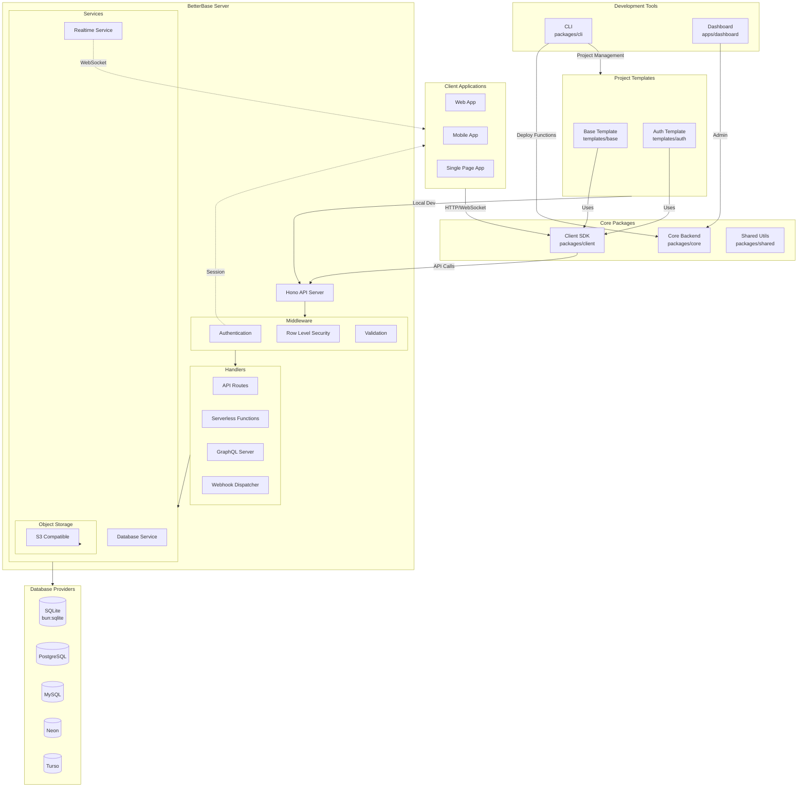
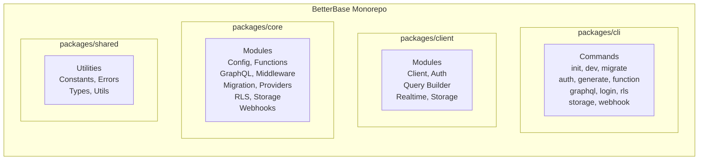
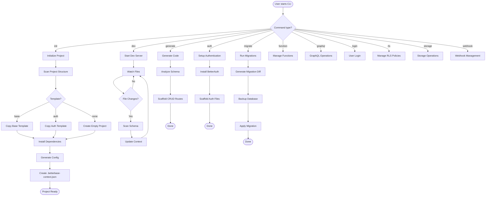
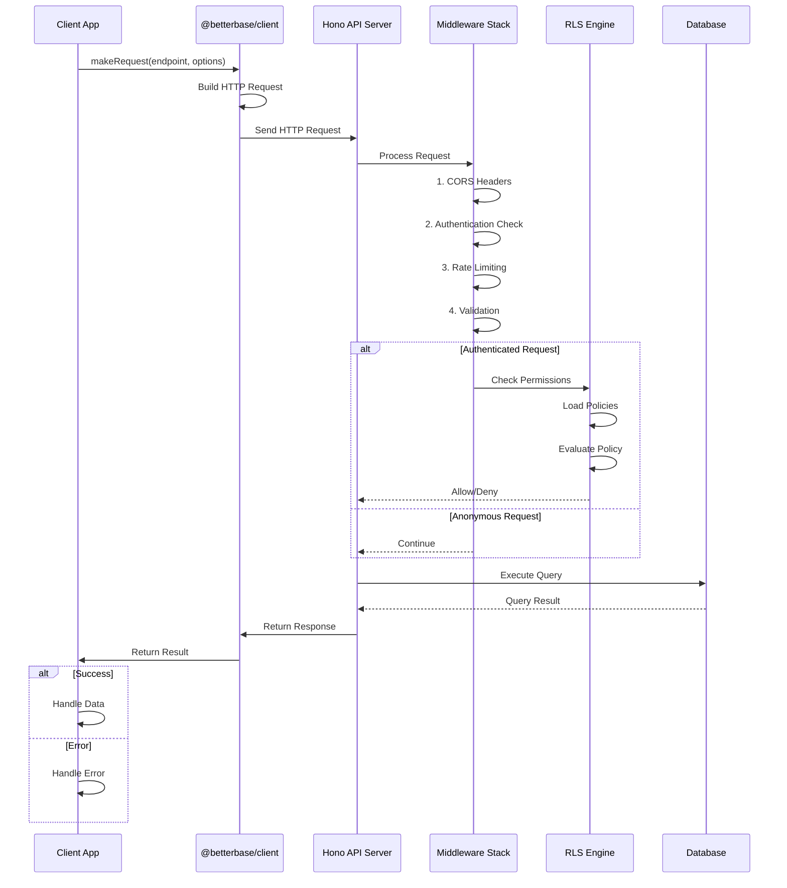
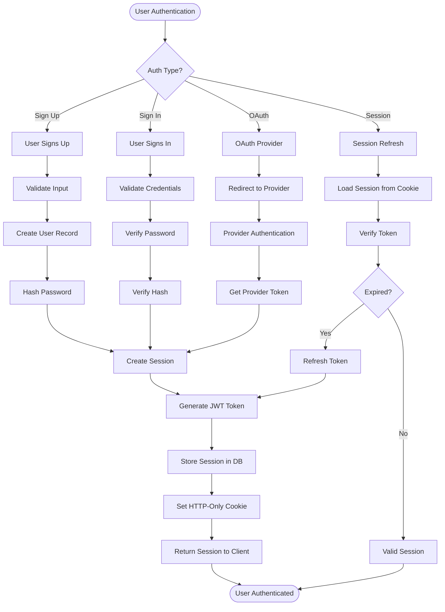
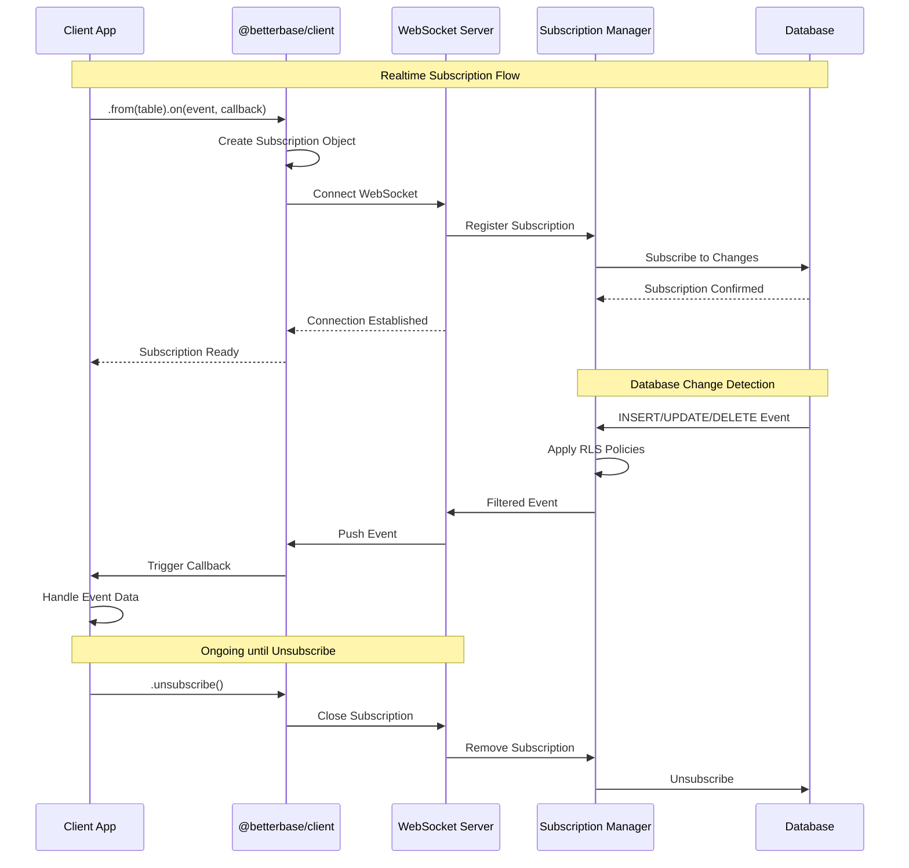
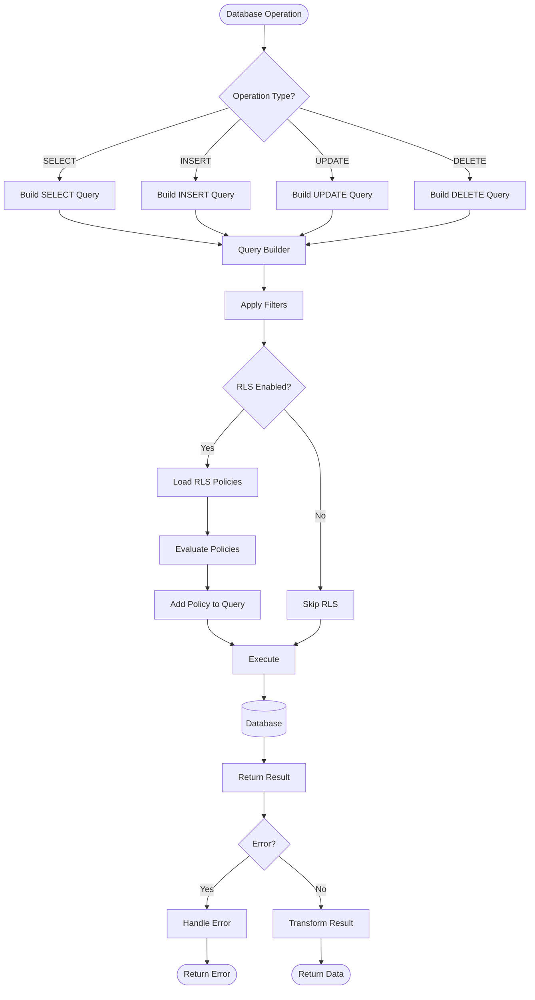
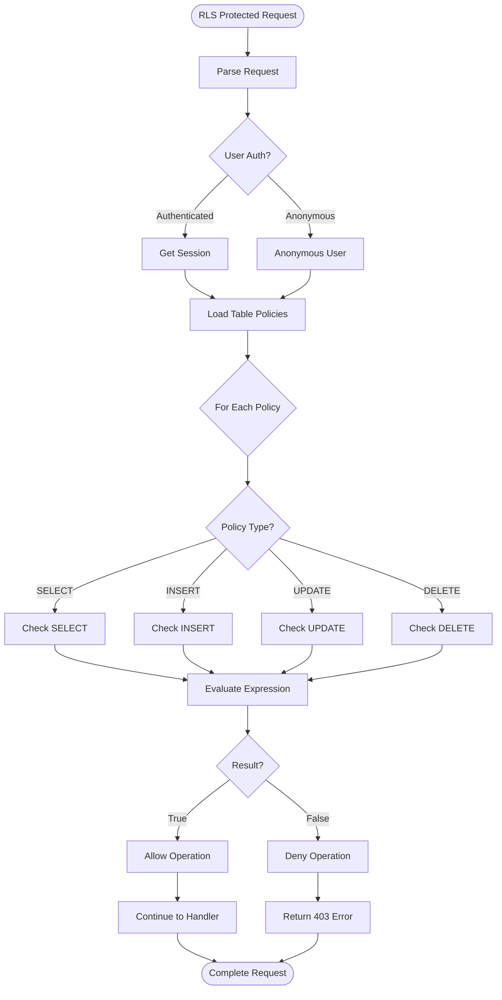

# BetterBase Documentation

> An AI-native Backend-as-a-Service platform built for the modern web. Inspired by Supabase, powered by Bun.

---

## Table of Contents

1. [Introduction](#introduction)
2. [Features](#features)
3. [Tech Stack](#tech-stack)
4. [Architecture](#architecture)
   - [System Architecture Overview](#system-architecture-overview)
   - [CLI Workflow](#cli-workflow)
   - [Client Request Flow](#client-request-flow)
   - [Authentication Flow](#authentication-flow)
   - [Realtime Subscription Flow](#realtime-subscription-flow)
   - [Database Operations Flow](#database-operations-flow)
5. [Getting Started](#getting-started)
6. [CLI Reference](#cli-reference)
7. [Client SDK](#client-sdk)
8. [API Reference](#api-reference)
9. [Best Practices](#best-practices)

---

## Introduction

BetterBase is an AI-native Backend-as-a-Service (BaaS) platform that provides developers with a complete backend solution featuring database management, authentication, realtime subscriptions, and serverless API endpoints—all with sub-100ms startup times using Bun's native SQLite driver.

### Vision

BetterBase aims to be the most developer-friendly BaaS platform by:
- Providing instant local development without Docker
- Generating AI-friendly context files for smarter autocomplete
- Offering full TypeScript type inference
- Supporting multiple database providers

---

## Features

| Feature | Description |
|---------|-------------|
| **AI Context Generation** | Automatic `.betterbase-context.json` generation for AI-assisted development |
| **Sub-100ms Startup** | Lightning-fast local development with `bun:sqlite` |
| **Docker-less Dev** | Run everything locally without containerization overhead |
| **TypeScript First** | Full type inference and strict mode throughout |
| **BetterAuth Integration** | Production-ready authentication out of the box |
| **Realtime Subscriptions** | WebSocket-based live data updates |
| **Multi-Provider Support** | PostgreSQL, MySQL (Planetscale), SQLite (Turso), Neon, Supabase |
| **RLS (Row Level Security)** | Built-in policy engine for fine-grained access control |
| **Serverless Functions** | Deploy custom API functions |
| **Storage API** | S3-compatible object storage |
| **Webhooks** | Event-driven architecture with signed payloads |

---

## Tech Stack

- **Runtime**: [Bun](https://bun.sh) — All-in-one JavaScript runtime
- **Framework**: [Hono](https://hono.dev) — Ultrafast web framework
- **ORM**: [Drizzle ORM](https://orm.drizzle.team) — TypeScript-native database toolkit
- **Auth**: [BetterAuth](https://www.better-auth.com/) — Authentication framework
- **Monorepo**: [Turborepo](https://turbo.build/) — Build system for JavaScript/TypeScript
- **Dashboard**: [Next.js 15](https://nextjs.org/) — React framework with App Router

---

## Architecture

### System Architecture Overview



### Package Structure



---

### CLI Workflow



---

### Client Request Flow



---

### Authentication Flow



---

### Realtime Subscription Flow



---

### Database Operations Flow



---

### RLS (Row Level Security) Flow



---

## Getting Started

### Prerequisites

Before using BetterBase, ensure you have the following installed:

- **Bun** ≥ 1.0.0 — [Installation Guide](https://bun.sh/docs/installation)
- **Node.js** ≥ 18.0.0 (for some packages)
- **Git** — Version control

```bash
# Verify Bun installation
bun --version

# Verify Node.js (if needed)
node --version
```

### Quick Start

#### 1. Initialize a New Project

```bash
# Create a new BetterBase project
bunx @betterbase/cli init my-project

# Or use the base template directly
bun create betterbase my-project
```

#### 2. Navigate to Project Directory

```bash
cd my-project
```

#### 3. Install Dependencies

```bash
bun install
```

#### 4. Configure Environment

Create a `.env` file in your project root:

```bash
# Server Configuration
PORT=3000
NODE_ENV=development

# Database (SQLite by default)
DB_PATH=local.db
```

#### 5. Run Development Server

```bash
bun run dev
```

Your server is now running at `http://localhost:3000`.

---

## CLI Reference

The BetterBase CLI (`bb`) provides commands for project management.

### Global Options

| Option | Description |
|--------|-------------|
| `-v, --version` | Display CLI version |
| `--help` | Show help information |

### Commands

#### `bb init [project-name]`

Initialize a new BetterBase project.

```bash
# Create project in current directory
bb init

# Create project in specified directory
bb init my-project
```

#### `bb dev [project-root]`

Watch schema and route files, regenerating `.betterbase-context.json` on changes.

```bash
# Watch current directory
bb dev

# Watch specific project
bb dev ./my-project
```

**Features:**
- Watches `src/db/schema.ts` for database changes
- Watches `src/routes` for API route changes
- Debounces regeneration (250ms)
- Automatic cleanup on exit

#### `bb migrate`

Generate and apply database migrations.

```bash
# Generate and apply migrations locally
bb migrate

# Preview migration diff without applying
bb migrate preview

# Apply migrations to production
bb migrate production
```

**Migration Features:**
- Automatic backup before destructive changes
- Destructive change detection
- SQL statement parsing
- Rollback on failure

#### `bb auth setup [project-root]`

Install and scaffold BetterAuth integration.

```bash
# Set up auth in current project
bb auth setup

# Set up auth in specific project
bb auth setup ./my-project
```

#### `bb generate crud <table-name> [project-root]`

Generate full CRUD routes for a table.

```bash
# Generate CRUD for 'posts' table
bb generate crud posts

# Generate CRUD in specific project
bb generate crud posts ./my-project
```

**Generated Endpoints:**

| Method | Endpoint | Description |
|--------|----------|-------------|
| `GET` | `/api/{table}` | List all records (paginated) |
| `GET` | `/api/{table}/:id` | Get single record |
| `POST` | `/api/{table}` | Create new record |
| `PATCH` | `/api/{table}/:id` | Update record |
| `DELETE` | `/api/{table}/:id` | Delete record |

#### `bb function`

Manage serverless functions.

```bash
# Create new function
bb function create my-function

# Deploy function
bb function deploy my-function

# List functions
bb function list
```

#### `bb rls`

Manage Row Level Security policies.

```bash
# Generate RLS policies
bb rls generate

# Apply policies
bb rls apply

# Test policies
bb rls test
```

#### `bb storage`

Manage object storage operations.

```bash
# Upload file
bb storage upload ./file.txt

# Download file
bb storage download path/to/file

# List files
bb storage ls
```

#### `bb webhook`

Manage webhooks.

```bash
# Create webhook
bb webhook create https://example.com/hook

# List webhooks
bb webhook list

# Delete webhook
bb webhook delete webhook-id
```

---

## Client SDK

The `@betterbase/client` package provides a TypeScript SDK for frontend integration.

### Installation

```bash
bun add @betterbase/client
# or
npm install @betterbase/client
```

### Creating a Client

```typescript
import { createClient } from '@betterbase/client';

const client = createClient({
  url: 'http://localhost:3000',
  key: 'your-anon-key', // Optional: for service-level access
});
```

### Configuration Options

```typescript
interface BetterBaseConfig {
  url: string;                    // Your backend URL
  key?: string;                  // Anonymous key for auth
  schema?: string;               // Database schema (optional)
  fetch?: typeof fetch;          // Custom fetch implementation
  storage?: {
    getItem: (key: string) => string | null;
    setItem: (key: string, value: string) => void;
    removeItem: (key: string) => void;
  };
}
```

### Query Builder

The query builder provides a chainable API for database operations:

```typescript
// Select with filters
const { data, error } = await client
  .from('users')
  .select('id, name, email')
  .eq('status', 'active')
  .order('createdAt', 'desc')
  .limit(10)
  .execute();

// Get single record
const { data, error } = await client
  .from('users')
  .single(userId);

// Insert record
const { data, error } = await client
  .from('users')
  .insert({
    email: 'new@example.com',
    name: 'New User',
  });

// Update record
const { data, error } = await client
  .from('users')
  .update(userId, { name: 'Updated Name' });

// Delete record
const { data, error } = await client
  .from('users')
  .delete(userId);
```

### Query Builder Methods

| Method | Description |
|--------|-------------|
| `.select(fields)` | Select specific fields (default: `*`) |
| `.eq(column, value)` | Filter by equality |
| `.in(column, values)` | Filter by values in array |
| `.order(column, direction)` | Sort results (`asc` or `desc`) |
| `.limit(count)` | Limit results count |
| `.offset(count)` | Offset results for pagination |
| `.single(id)` | Get single record by ID |
| `.insert(data)` | Insert new record |
| `.update(id, data)` | Update existing record |
| `.delete(id)` | Delete record |

### Authentication

```typescript
// Sign up
const { data, error } = await client.auth.signUp(
  'user@example.com',
  'password123',
  'John Doe'
);

// Sign in
const { data, error } = await client.auth.signIn(
  'user@example.com',
  'password123'
);

// Get current session
const { data, error } = await client.auth.getSession();

// Sign out
const { error } = await client.auth.signOut();
```

### Authentication Methods

| Method | Parameters | Description |
|--------|------------|-------------|
| `.signUp(email, password, name)` | `string, string, string` | Create new account |
| `.signIn(email, password)` | `string, string` | Sign in with credentials |
| `.signOut()` | — | End current session |
| `.getSession()` | — | Get current session |

### Realtime Subscriptions

```typescript
// Subscribe to table changes
const subscription = client.realtime
  .from('posts')
  .on('INSERT', (payload) => {
    console.log('New post:', payload.data);
  })
  .on('UPDATE', (payload) => {
    console.log('Updated post:', payload.data);
  })
  .on('DELETE', (payload) => {
    console.log('Deleted post:', payload.oldData);
  })
  .subscribe();

// Unsubscribe when done
subscription.unsubscribe();
```

### Storage

```typescript
// Upload file
const { data, error } = await client.storage.upload(
  'avatars/user123.png',
  fileObject
);

// Download file
const { data, error } = await client.storage.download(
  'avatars/user123.png'
);

// Get public URL
const url = client.storage.getPublicUrl('avatars/user123.png');

// Delete file
const { error } = await client.storage.delete('avatars/user123.png');
```

---

## API Reference

### REST Endpoints

#### Users

| Method | Endpoint | Description |
|--------|----------|-------------|
| `GET` | `/api/users` | List all users (paginated) |
| `GET` | `/api/users/:id` | Get user by ID |
| `POST` | `/api/users` | Create new user |
| `PATCH` | `/api/users/:id` | Update user |
| `DELETE` | `/api/users/:id` | Delete user |

#### Authentication

| Method | Endpoint | Description |
|--------|----------|-------------|
| `POST` | `/api/auth/signup` | Register new user |
| `POST` | `/api/auth/signin` | Sign in user |
| `POST` | `/api/auth/signout` | Sign out user |
| `GET` | `/api/auth/session` | Get current session |
| `POST` | `/api/auth/refresh` | Refresh session |

#### Storage

| Method | Endpoint | Description |
|--------|----------|-------------|
| `GET` | `/api/storage/files` | List files |
| `POST` | `/api/storage/upload` | Upload file |
| `GET` | `/api/storage/:path` | Download file |
| `DELETE` | `/api/storage/:path` | Delete file |

---

## Best Practices

### Database Schema

1. **Use UUIDs for primary keys**: BetterBase provides a `uuid()` helper

```typescript
import { uuid } from './db/schema';

export const users = sqliteTable('users', {
  id: uuid().primaryKey(),
  // ...
});
```

2. **Add timestamps to all tables**: Use the `timestamps` helper

```typescript
import { timestamps } from './db/schema';

export const posts = sqliteTable('posts', {
  id: uuid().primaryKey(),
  title: text('title').notNull(),
  ...timestamps,
});
```

3. **Use soft deletes**: Use the `softDelete` helper for data recovery

```typescript
import { softDelete } from './db/schema';

export const posts = sqliteTable('posts', {
  id: uuid().primaryKey(),
  ...softDelete,
});
```

### Security

1. **Always enable RLS**: Enable Row Level Security on all tables

```typescript
// In your schema
export const users = sqliteTable('users', {
  id: uuid().primaryKey(),
  email: text('email').notNull(),
});

// Enable RLS
await enableRLS('users');
```

2. **Create policies for common patterns**:

```typescript
// Users can only see their own data
createPolicy('users', 'read', 'auth.uid() = user_id');

// Only admins can delete
createPolicy('users', 'delete', 'auth.role() = admin');
```

3. **Validate all inputs**: Use the validation middleware

```typescript
import { validate } from './middleware/validation';

app.post('/api/users', validate(userSchema), async (c) => {
  // Handler code
});
```

### Performance

1. **Use indexes on frequently queried columns**:

```typescript
export const posts = sqliteTable('posts', {
  id: uuid().primaryKey(),
  authorId: text('author_id').notNull(),
  status: text('status').notNull(),
  createdAt: integer('created_at').notNull(),
}, (table) => ({
  authorIdx: index('author_idx').on(table.authorId),
  statusIdx: index('status_idx').on(table.status),
}));
```

2. **Limit query results**: Always use `.limit()` for large tables

```typescript
const posts = await client
  .from('posts')
  .select()
  .limit(50)
  .execute();
```

3. **Use pagination for lists**: Implement offset/limit pagination

```typescript
const page = 1;
const limit = 20;
const offset = (page - 1) * limit;

const posts = await client
  .from('posts')
  .select()
  .limit(limit)
  .offset(offset)
  .execute();
```

### Development Workflow

1. **Use the dev server for development**: It watches for changes

```bash
bb dev
```

2. **Generate context before AI coding**: Ensures AI has latest schema

```bash
# Automatically done by dev server
# Or manually:
bb dev --generate
```

3. **Use templates for new projects**: Start with a template

```bash
# Auth template includes:
# - BetterAuth setup
# - User table and policies
# - Session management
bb init my-app --template auth
```

---

## License

Apache 2.0 License - see [LICENSE](LICENSE) for details.

---

## Support

- [Documentation](https://docs.betterbase.dev)
- [GitHub Issues](https://github.com/betterbase/betterbase/issues)
- [Discord Community](https://discord.gg/betterbase)
